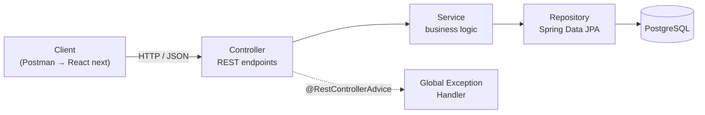
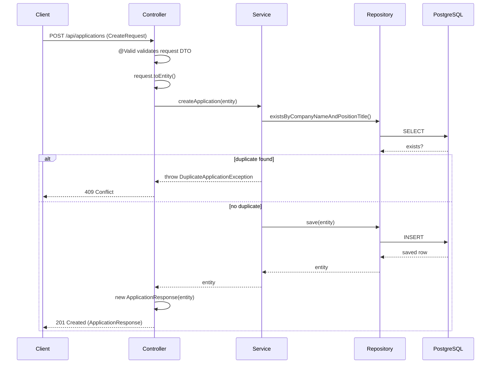
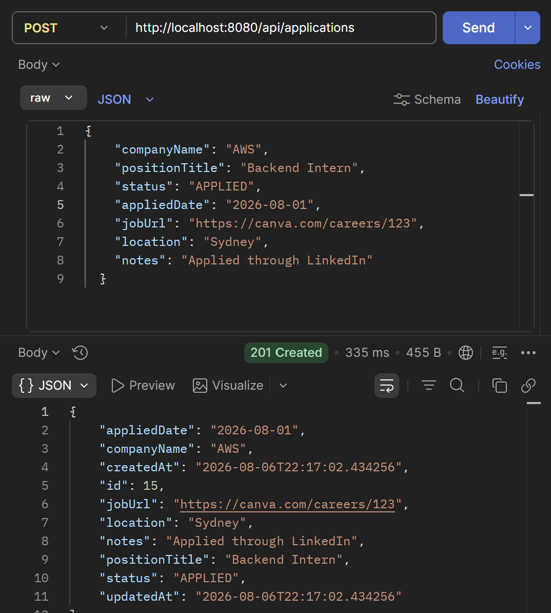
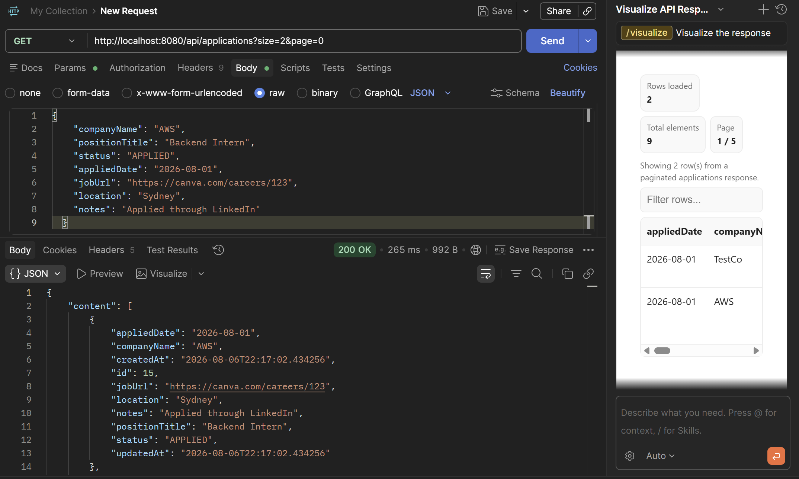
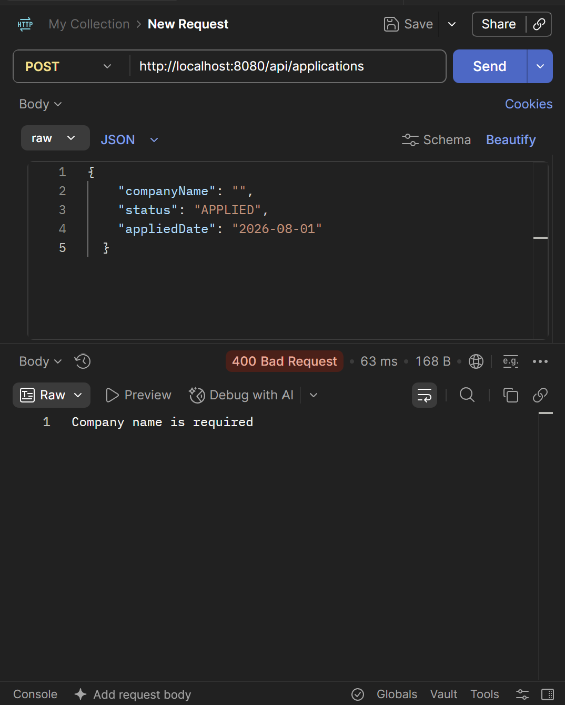

# ApplyGrid

**Track every job application like a spreadsheet, but find what you're looking for instantly.**

Log applications, search them, filter by status, keep everything organized, all powered by a Spring Boot API underneath. Real analysis and dashboards are next.

---

## What Is This

ApplyGrid started from a simple frustration: spreadsheets are great for logging job applications row by row, but finding anything in them later means scrolling, or building your own filters from scratch. Right now, ApplyGrid does that core job well: add an application, search it, filter it by status, sort it, all through a real backend instead of a spreadsheet. Real analysis (dashboards, charts, trends) is the direction it's headed next, once the foundation underneath is solid.

Right now it's a fully working REST API (Postman-tested, production-shaped), with authentication and a React frontend actively being built next.

Every feature was implemented one at a time: design → implement → test → commit, with an explicit rule: **no technology gets added unless the current phase actually needs it.**

---

## Tech Stack

| Layer | Technology |
|---|---|
| Language | Java 21 |
| Framework | Spring Boot 4.1.0 |
| Data Access | Spring Data JPA / Hibernate |
| Database | PostgreSQL |
| Validation | Jakarta Bean Validation |
| API Testing | Postman |
| Build Tool | Gradle |
| Version Control | Git / GitHub |

---

## Architecture



A standard layered architecture, on purpose: Controller only handles HTTP in/out, Service owns business rules, Repository only talks to the database. Nothing knows more than it needs to.

---

## Features

### ✅ Shipped (v1)

- **Full CRUD** for job applications (create, read, update, delete)
- **Search** across company name, position title, and notes (case-insensitive)
- **Status filtering** (Applied / Interview / Offer / Rejected / No Response)
- **Sorting** by any field, ascending or descending
- **Pagination** with configurable page size
- **Global exception handling** — consistent error responses instead of raw stack traces
- **Input validation** — required fields, date constraints, duplicate-application prevention
- **DTO layer** — API contracts fully decoupled from database entities

### 🚧 Building Next (still v1)

- [ ] User authentication (JWT)
- [ ] User registration & login
- [ ] Per-user data isolation
- [ ] Dashboard API (application stats, recent activity)
- [ ] Unit & integration tests (JUnit, Mockito)
- [ ] React frontend (CRUD screens)
- [ ] AWS deployment (Elastic Beanstalk + RDS)

---

## API Documentation

Base URL: `/api/applications`

| Method | Endpoint | Description |
|---|---|---|
| `POST` | `/api/applications` | Create a new application |
| `GET` | `/api/applications` | List applications (supports search, filter, sort, pagination) |
| `GET` | `/api/applications/{id}` | Get a single application by ID |
| `PUT` | `/api/applications/{id}` | Update an existing application |
| `DELETE` | `/api/applications/{id}` | Delete an application |

### Query Parameters (on `GET /api/applications`)

| Param | Type | Description | Default |
|---|---|---|---|
| `keyword` | string | Search company name, position, or notes | — |
| `status` | enum | Filter by `APPLIED`, `INTERVIEW`, `OFFER`, `REJECTED`, `NO_RESPONSE` | — |
| `page` | int | Page number (0-indexed) | `0` |
| `size` | int | Results per page | `10` |
| `sortBy` | string | Field to sort by | `createdAt` |
| `direction` | string | `asc` or `desc` | `desc` |

### Example — Create Application

**Request**
```http
POST /api/applications
Content-Type: application/json

{
  "companyName": "Canva",
  "positionTitle": "Backend Intern",
  "status": "APPLIED",
  "appliedDate": "2026-07-29",
  "jobUrl": "https://canva.com/careers/123",
  "location": "Sydney",
  "notes": "Applied through LinkedIn"
}
```

**Response** `201 Created`
```json
{
  "id": 1,
  "companyName": "Canva",
  "positionTitle": "Backend Intern",
  "status": "APPLIED",
  "appliedDate": "2026-07-29",
  "jobUrl": "https://canva.com/careers/123",
  "location": "Sydney",
  "notes": "Applied through LinkedIn",
  "createdAt": "2026-07-30T01:37:00.207",
  "updatedAt": "2026-07-30T01:37:00.207"
}
```

### Error Responses

| Status | Trigger | Example Body |
|---|---|---|
| `400 Bad Request` | Validation failure (empty company name, future applied date, etc.) | `"Company name is required."` |
| `404 Not Found` | Application ID doesn't exist | `"Application with id 999 not found"` |
| `409 Conflict` | Duplicate application (same company + position) | `"You have already applied to Canva for Backend Intern."` |

### Request Flow



---

## Why this Project
Most portfolio projects optimize for feature count. This one optimizes for **explainability**. None of the decisions below were the "correct" answer copied from a tutorial, each one came from actually hitting a problem first: a duplicate application saved twice, a 500 error with no message, an Entity leaking fields it shouldn't. The goal was to build something that *looks* simple on the surface but is backed by the same patterns used in production Spring Boot services.

### Design Decisions

**Why a DTO layer instead of exposing the Entity directly?**

Create and Update use separate DTOs, not because their fields differ (they're identical), but because they mean different things. `CreateRequest.toEntity()` builds a brand-new `Application`. `UpdateRequest` gets applied to an entity already fetched from the database via `application.update(...)`, relying on Hibernate's dirty checking to persist the change without an explicit `save()` call. Collapsing both into the Entity directly would also let clients set `id` or `createdAt` on a create request, fields the system should own, not the caller.

**Why a Service layer when most methods just call the Repository?**

The Create endpoint isn't just a passthrough. `createApplication` checks whether an application with the same company and position already exists before saving, and throws a custom `DuplicateApplicationException` if it does. That's business logic, not HTTP handling, so it belongs in the Service, not the Controller. As more rules get added later, they have a clear home instead of bloating the Controller.

**Why custom exceptions and a centralized `GlobalExceptionHandler` instead of try/catch everywhere?**

Two domain-specific exceptions were built for this project, `ApplicationNotFoundException` and `DuplicateApplicationException`, plus handling for Spring's own `MethodArgumentNotValidException` from `@Valid`. All three are caught in one place, `global/exception/GlobalExceptionHandler`, and mapped to the correct status code (404, 409, 400) with a clear message. Without it, every one of those failures fell back to a raw 500 with a full stack trace, which is what actually happened before this was added. Adding a new exception type now means one `@ExceptionHandler` method, not touching every Controller that could throw it.

**Why no premature complexity (Redis, Kafka, microservices)?**

Deliberately excluded in v1. The goal was to deeply understand a monolithic Spring Boot service before reaching for distributed-systems tooling that would obscure, not demonstrate, the fundamentals.

---

## Project Structure

```
src/main/java/com/yeinjeong131/careeros/
├── domain/application/
│   ├── dto/
│   │   ├── ApplicationCreateRequest.java
│   │   ├── ApplicationUpdateRequest.java
│   │   └── ApplicationResponse.java
│   ├── Application.java
│   ├── ApplicationStatus.java
│   ├── ApplicationRepository.java
│   ├── ApplicationService.java
│   ├── ApplicationController.java
│   ├── ApplicationNotFoundException.java
│   └── DuplicateApplicationException.java
└── global/exception/
    └── GlobalExceptionHandler.java
```

---

## Getting Started

```bash
# clone
git clone https://github.com/YeinJeong131/ApplyGrid.git
cd ApplyGrid

# configure your local PostgreSQL connection in
# src/main/resources/application.properties

# run
./gradlew bootRun
```

API available at `http://localhost:8080/api/applications`.

---

## V1 Roadmap

The scope committed to for the initial working product.

- [x] Phase 1 — Project design (ERD, API design)
- [x] Phase 2 — Project setup (Spring Boot + PostgreSQL)
- [x] Phase 3 — Application CRUD + DTO layer
- [x] Phase 4 — Search, filter, sort, pagination, exception handling, validation
- [ ] Phase 5 — Authentication (Spring Security + JWT)
- [ ] Phase 6 — Dashboard API (stats, recent activity)
- [ ] Phase 7 — React frontend (CRUD screens)
- [ ] Phase 8 — Testing (JUnit, Mockito)
- [ ] Phase 9 — AWS deployment
- [ ] Phase 10 — Documentation & portfolio polish

---

## V2 Vision

Once v1 is a solid, tested, deployed product, here's the direction it could grow, deliberately *not* built yet, so v1 stays shippable instead of sprawling.

| Feature | What it adds |
|---|---|
| **Interviews as a first-class entity** | Interviews get their own model (date, type, round, outcome) instead of living inside `Application.status`, supports multiple interview rounds per application, and powers views like "interviews this week" and weekly application trends |
| **Companies view** | Aggregate applications by company, "3 applications to Google across 2 years" |
| **Analytics dashboard** | Charts for application funnel (Applied → Interview → Offer), rejection rate, most-applied tech stacks |
| **Resume / cover letter attachments** | File upload + storage (likely S3) tied to each application |
| **Notifications** | Reminders for upcoming interviews or stale applications |

---

## API in Action

Tested end-to-end with Postman, every endpoint, every error case.

**Create Application — `201 Created`**


**Pagination — `200 OK`**


**Validation error — `400 Bad Request`**


---